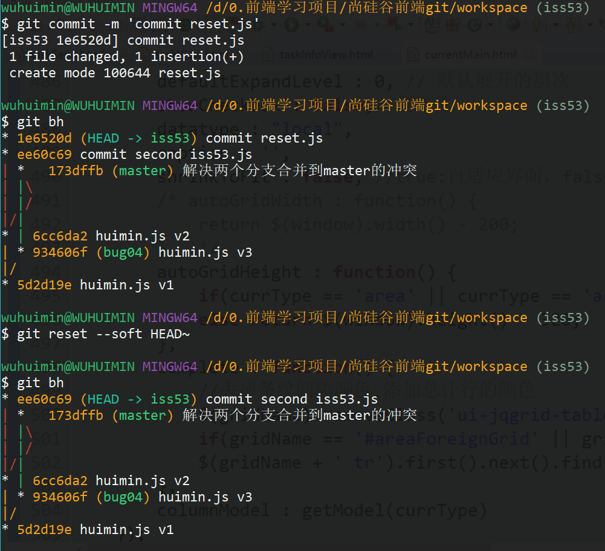

# 尚硅谷前端git学习随记

## 了解版本控制
+ 什么是版本控制
    - 记录文件内容的变化，便于将来查阅版本修订情况
+ 版本控制的作用
    - 可以把文件回溯到之前某个时间节点的状态，甚至回退项目
    - 比较问价变化的细节，查看是谁在哪个时间修改了文件，从而定位缺陷
+ 版本控制系统分为：集中式、分布式
+ 集中式版本控制系统：SVN（淘汰）
    - 例如CSV，SVN，Perforce
    - 有一个单一的集中管理的服务器，保存所有代码的修订版本
    - 所有协同工作的客户端都可以读取服务器的文件，提交文件
    - 在管理项目时，存放的是版本之间的**差异**
        * 1号的全量代码是A1，2号的全量代码是A2，3号是A3，。。。
        * SVN存的是A1， A2-A1，A3-A2
        * 存的文件少，占地小，但是回滚极慢
    - 好处：
        * 管理员可以轻松设置每个开发者的权限
        * 每个开发人员都能看到项目中其他人的提交
    - 坏处：
        * 单一服务器的故障，所有历史版本就都丢失了，因为每个额客户端本地只保存了最新的修订版本
        * 如果中央服务器宕机一小时，所有客户端都无法提交
+ 分布式版本控制系统：Git（完胜）
    - 性能，设计都比svn强很多，操作上比svn复杂一丢丢
    - 客户端在拉取最新版本的文件时，还干了一件事，就是把整个代码仓库的历史记录完整的拉取下来存在本地
    - 然而由于优秀的压缩/解压缩算法，git拉取的整个代码仓库的代码却只比svn拉取最新版本的代码体积多一点点
    - 在管理项目时，存放的不是版本之间的差异，存的是索引（占空间小）
        * 1号的全量代码是A1，2号的全量代码是A2，3号是A3，。。。
        * SVN存的是A1， A1 A2，A1 A2 A3
        * 存的文件多，git团队对代码做了极致压缩占地比svn大不了多少，但是回滚极快
    - 中心思想：去中心化，每个客户端都是服务器都是中心
        * 类似于区块链的思想：去中心化。买家和卖家交易，有一个中心就是电商平台，去掉中心就是不通过电商平台做交易，有一个问题是信任问题，区块链就是解决信任问题。有一个区块，你要和卖家交易就在区块里大喊一声你要交易了，如果卖家不发货就失去了信任，就被踢出区块了，这样解决信任问题。
    - 还可以把代码提交到远端代码仓库gitHub，让项目组外的人和项目协作
    - 分布式
    - 好处：
        * 每个客户端本地都保存着文件全量的修订记录，所以不怕服务器宕机
        * 分支切换速度快
        * 容量小（压缩）
        * 设计简单，完全分布式
        * 支持上千个分支的并行开发
        * 有能力管理超大型项目的版本，如linux操作系统项目

    
    

## 安装和配置
+ 安装就傻瓜式next就行
    - git命令行 git bash 、 git图形化 git GUI
    - git bash命令行操作指令不会变，GUI每个都不同，所以得会命令行操作
    - 装好之后`git --version`看版本
+ git bash
    - git bash的窗口和windows cmd打开的DOS窗口有本质的不同
    - 一个是窗口敲的是linux命令，一个是DOS命令
+ git配置
    - 配置一次之后都能改，git升级了也能沿用之前的配置
    - 参数`--system`表示电脑所有的用户都有效，`--global`表示对当前用户有效，什么都不写表示项目级别的配置只对本项目有效出现在本项目.git/config的配置中
    - 配置用户名和邮箱：git每次提交都会引用这两个信息，说明提交人是谁
    ```bash
    git config --global user.name "whm"
    git config --global user.email "example@qq.com"
    ```
    - 查看git的所有配置`git global --list`

## 底层概念
+ 初始化仓库`git init`
    - 把文件夹变成git管理仓库，初始化之后会有`.git`文件夹
+ `.git`文件夹目录
    - hooks 包含客户端或服务端的钩子程序
        * 在指定的事件触发执行，类似回调函数
        * 比如pre-commit脚本，是在提交之前要执行的脚本，检查提交格式
    - info 全局排除文件
        * 全局git不需要管理的文件就配置在这里面
    - logs 日志信息
    - **objects**  存储所有版本库区域的数据内容，相当于数据库
    - config 保存项目级别的配置信息
    - description 保存对仓库的描述信息
    - **HEAD** 指向目前被检出的分支
    - **index** 保存暂存区的信息 
+ 基础的linux命令
    - `clear` 清除屏幕
    - `echo` 向控制台打印信息，相当于console.log
        * `echo 'test info.' > test.txt` 创建文件test.txt并且向里面写入内容
    - `ll` 查看当前目录下的子文件
        * `ls`也能看目录下的文件
    - `find` 查看指定文件夹目录下的子孙文件和文件夹
        * 比如`find ./    find ../`
        * `find ./ -type f` 查看文件下的所有子孙文件，不包括文件夹
    - `rm` 删除文件
    - `mv 原文件名 新名字` 为文件重命名
    - `cat 文件的路径` 查看文件内容
    - `vim 文件路径` 编辑文件
        * `i` 进入编辑模式
        * `esc` 退出编辑模式
        * `:wq` 保存并退出
        * `:q!` 不保存并退出
        * `:set nu` 设置行号
    - `cd 路径` 打开文件夹
    - `指令1|指令2` 执行两个命令，使用|隔开
+ git的三个区域：工作区、暂存区、版本库
    - 现在工作区写东西，写了一段了添加到暂存区，觉得差不多稳定了在提交到版本库
    - 工作区：写代码的区域，就是放代码的文件夹，爱删删改改改，git不管你
    - 版本库：用来存放项目所有修订版本的代码仓库
+ git的三个对象：git对象、树对象、提交对象
    - git对象
        * git对象是key:val键值对，key是val对应的hashCode
        * 键值对形式的git对象在git内部是blob数据类型
        * git的版本库objects文件夹，核心是一个简单的键值对数据库
        ```bash
        #手动将一个文件存到git版本库,返回文件的hash键值
        echo 'huimin' > 'huimin.js'
        git hash-object -w ./huimin.js
        #返回7a55992ed60439a39bb774a6b43b263c8aef5041
        #可以查看压缩过的值
        cat ./.git/objects/77/77b1b3....
        #可以查看压缩前的值 -p查看内容 -t查看类型
        git cat-file -p 哈希值
        #其中文件夹路径是.git/objects/7a/55992ed60439a39bb774a6b43b263c8aef5041
        git cat-file -p 7a55992ed60439a39bb774a6b43b263c8aef5041
        #vim修改文件huimin.js并在此想数据库提交
        git hash-object -w ./huimin.js
        #查看数据库会发现新存了一个全量文件，证明Git是全量保存文件修订版本的
        find ./.git/objects -type f
        git cat-file -p 哈希值
        #底层命令，向版本库数据库写入内容
        #首先向控制台输出一个字符串huimin,再从标准输入读取刚刚打印的字符串并写入objects版本库数据库，最后返回键值，这个键值是一个hashCode,可以根据哈希键值查看对应的值
        echo 'huimin' | git hash-object -w --stdin 
        ```
        
    - 树对象
        * 每个git对象只能代表一个文件的一次改动，不能代表整个项目所有文件的一个快照一个时间点的内容。而且一个git对象只保存了文件的内容没有保存文件名。而且上述的操作都是直接将工作区的文件直接存入版本库，没有涉及到暂存区。解决方案就是--树对象
        * 树对象可以解决文件名保存的问题，将多个文件组织到一起
        * 数据库所有内容都以树对象和数据对象（git对象）的形式存储，树对象对应了目录项，git对象对应文件内容
        * 一个树对象包含多条记录，每个记录都是一个指针，指向一个Git对象或者一个子树对象
        ```bash
        #清空工作区的所有文件，就把git仓库删了，重新git init一下
        echo 'huimin' > huimin.js
        echo 'test' > test.txt
        #查看文件的hash写进数据库
        git hash-object -w ./huimin.js
        git hash-object -w ./test.txt
        #通过update-index命令创建暂存区 
        git update-index --add --cacheinfo 100644 文件hashCode 文件名 
        #-add 因为该文件不再暂存区中，首次添加要加-add
        #-cacheinfo  如果文件已经在objects版本库中则需要添加 -cache
        #100644 普通文件  100755 可执行文件  120000一个符号链接

        #查看暂存区的文件
        git ls-files -s
        #现在暂存区的多个文件可以代表整个项目新的修订版本。生成树对象，返回树对象的hashCode
        git write-tree
        #查看数据库的树对象类型 tree
        git cat-file -t 树对象hashCode

        #生成了两个版本之后，有两个树对象，现在想把地一个树对象作为第二个的子树
        git read-tree --prefix=bak d5cd1996b184da6bd7ffd17196c15d02f0c5c5af
        git write-tree
        #查看新的树对象
        git cat-file -p  f6fea09cd58853ef33e9e3df290fb79693303f2e
        ``` 
        
        
        
    - 提交对象
        * 每个树对象对应的快照版本，并不知道是改变了什么，即没写注释。于是就有了提交对象
        * 提交对象就是对树对象的一个包裹，对树对象做一些解释
        ```bash
        #为一个树对象创建首个提交对象  git commit-tree 树的哈希 返回提交对象的哈希
        echo 'commit despription' | git commit-tree  f6fea09cd58853ef33e9e3df290fb79693303f2e
        #查看提交对象的类型 commit
        git cat-file -t  2c89abe808e3dc79d8577b9b63cd6ce0428cd60b
        #查看提交对象的内容 对应那颗树对象，提交人，作者，注释内容都有
        git cat-file -p  2c89abe808e3dc79d8577b9b63cd6ce0428cd60b

        #创建第二个提交对象 需要指定上一次的提交对象为父亲，于是提交对象形成一个链条
        echo 'commit despription' | git commit-tree  df34a[本次提交的版本树对象哈希]  -p  f6fea[上次提交的提交对象哈希]
        ```
        
        
+ 总结
    - 一个Git对象对应一个文件的内容修订产生的新版本
    - 一个树对象对应一个项目多个文件修订产生的一个时间点的快照版本
    - 一个提交对象就是对树对象的一个包裹，对树对象做一些注释，并且除了第一个提交对象外每个提交对象都有父提交对象，并形成一条链
    - 项目的一个完整的版本是一个提交对象，项目的一个快照是一个树对象
    - objects文件夹里面有git对象，tree对象，commit对象压缩后的文件值，这些值的键是一个哈希码objects/d7/2c89abe8,哈希键就是d72c89abe8
    - git对象
        * `git hash-object [-w] fileUrl` 生成/返回一个key(hash值)：val(压缩后的文件blob) 存到.git/objects
    - tree对象
        `git update-index --add --cached 100644 githash fileName` 向暂存区添加记录，让git对象-对应上文件名,存到.git/index
        `git write-tree` 生成树对象存到.git/objects
    - commit对象
        * `echo 'comment' | git commit-tree treehash` 生成提交对象存到.git/objects
    - 公用
        * `git cat-file -t hash` 查看对象类型 
        * `git cat-file -p hash` 查看对象未压缩的内容 
        * `find ./.git/objects -type f` 查看版本库中的所有的对象 
        * `git ls-files -s` 查看暂存区文件
    - 上述这些全都是git的底层命令

## 高层命令（CRUD）
+ `git status` 查看项目文件状态
    - 已跟踪：add过一次就是已跟踪文件了
        * 已修改
        * 已暂存
        * 已提交
    - 未跟踪：从来没有add过
        * `git add fileUrl` 开始追踪文件
+ `git add fileUrl` 添加到暂存区
    - `git add ./`操作层面上的含义是将工作区的修改部分添加到暂存区
    - 底层的实现是：
        * 先将工作区的修改后的文件在版本库生成git对象，再从版本库中读出git对象添加到index暂存区
        * 相当于
            1. `git hash-object -w 文件路径/文件名`修改了几个文件就执行几次本命令
            2. `git update-index ...`修改了几个文件就执行几次本命令
        * 工作目录里面修改了3个文件，就在objects文件夹里生成3个git对象
        * 对于一个修改的文件只要add一次就会生成一个git对象
        * 所以如果只是add到了暂存区，没有提交，文件也不会丢失。因为版本库早就已经开始管理修订的文件了，只要能找到修改后文件的哈希值，就一定能找到文件的修改内容
+ `git commit -m 'first commit'` 提交项目版本
    - 操作层面上的含义是将暂存区的文件内容提交到版本库
    - 底层的实现是：
        * 参照暂存区的最新内容在版本库创建一个树对象
        * 再将树对象读取出来，加上提交时的注释，包裹成一个提交对象，存到版本库中
        * 相当于：
            1. `git write-tree`
            2. `git commit-tree ...`
        * 所以一次完整提交生成一个提交对象，一个树对象，多个git对象
    - `git commit` 需要写很多注释信息，需要换行的那种，进入vim写注释了就
+ `git commit -a [-m]` 将文件提交并加入暂存
    - 没有被跟踪过的文件不能使用-a命令
    - 必须是add过的文件才可以使用git commit -a -m 指令
+ `git diff` 查看已追踪的文件有哪些还没暂存（工作区和暂存区的区别）
+ `git diff --cached/staged` 查看哪些文件已经暂存了还没提交（暂存区和版本库的具体区别）
+ `git log` 查看提交记录，如果记录很多,会分页，按q退出 
+ `git log --pretty=oneline/--oneline` 在一行查看提交历史记录
    - 出来的记录都是提交对象的哈希码，和每次提交的注释
    - 当切换到下游的分支之后,会显示不全
        * `git log --oneline --decorate --graph --all` 可以显示最完整的提交记录和别的分支
+ `git rm fileUrl` 删除工作区文件并将修改添加到暂存区
    - 相当于`rm a.txt  git add ./a.txt`
    - 没有创建新的git对象到版本库
    - 按需提交
+ `git mv oldFileName newFileName` 将工作区文件重新命名并将修改添加到暂存区
    - 相当于`mv a.txt b.txt   git add ./a.txt`
    - 创建了新的git对象保存b文件
    - 删除暂存区的a文件，读取版本库的b文件添加到暂存区
+ 新增文件(C)
    1. `git add fileUrl`
    2. `git status`
    3. `git commit -m`
+ 修改文件(U)
    1. `git add fileUrl`
    2. `git status`
    3. `git commit -m`
+ 查询(R)
    - `git status`
    - `git log --oneline`
    - `git diff`
    - `git diff --cached`
+ 删除文件(D)
    1. `git rm fileName`
    2. `git status`
    3. `git commit -m` 
    - 删除文件对于git来说也是一次修改
    - 操作仍然需要添加到暂存区，在提交
    - 底层实现是：
        * 不生成新的git对象，删除暂存区的指定文件
        * 生成新的树对象，树对象组织的多个git对象中没有了指定文件的git对象了
        * 生成新的提交对象，包裹树对象 
+ 文件换名(D)
    1. `git mv fileName`
    2. `git status`
    3. `git commit -m` 
    - 文件更换名字对于git来说等于删除一个文件，在新增一个文件
    - 操作仍然需要添加到暂存区，在提交
    - 底层实现是：
        * 原名文件a.txt 更名后文件b.txt
        * 生成b文件的git对象
        * 在暂存区删除a文件，添加b文件
        * 生成指向b文件和别的文件的树对象
        * 生成提交对象

## 分支操作 
+ 认识分支：分支操作是把你的开发工作从主线分离出来，以免影响开发主线。就是自己要写一个新功能或修复一个缺陷，需要从主线上开辟一个分支来开发。几乎所有版本控制系统都支持分支操作
+ 分支的本质：一个指向提交对象的指针
+ 分支的存储
    - `.git/refs` 里面保存所有分支的指针哈希值
    - `.git/HEAD` 里面保存目前被检出的分支的指针哈希值
+ HEAD指针
    - HEAD本质是一个可变指针
    - 指向当前正在使用的分支，默认指向master分支
    - 所有的分支指针自己不改变，但是当前分支会被HEAD可变指针带着改变
    - 每次有新的提交的时候，HEAD都会带着当前分支指针一起往前移动
        * 比如HEAD指向hm分支，此时HEAD hm都指向de256
        * 在hm分支上有一次新的提交，提交对象的哈希是d567q，HEAD hm都改为指向d567q
        * 验证方式是.git/refs/heads文件夹下的两个文件内容在变化
    - 切换分支就是让HEAD指针指向不同的分支
    
    
+ 主分支/master分支
    - 主分支是git默认的分支
    - `.git/refs/heads/master`保存着主分支的指针哈希值
    
+ 查看分支
    - `git branch` 查看已有的分支,以及当前使用的是哪个分支
    - `git branch -v` 查看当前分支的最新一次提交
    - `git log --oneline --decorate --graph --all` 查看项目分支分叉图
        * 为命令配置别名
        * `git config --global alias.别名 '不带git的命令字符串'`
+ 创建分支
    - `git branch branchName` 创建新的分支，在HEAD指向的最新一次提交对象上新建分支
    - `git branch branchName commithash(可以是短hash)` 新建一个分支并指向指定的提交对象
        * 有新的分支名和指定提交对象的哈希值
        * 俗称时光机
+ 切换分支
    - `git checkout branchName` 切换到指定分支
        * 切换分支会改变3个地方，版本库不动
            1. HEAD指针指向新分支
            2. 工作区的文件被替换为新分支下的文件
            3. 暂存区的文件被替换为新分支下的文件
        * 最佳实践：每次切换分支之前一定要git status保证当前分支下是干净的（所有文件已提交）
        * 注意：如果在切换分支的时候，存在为暂存的修改或者未提交的暂存，会成功切换，并且这些文件会被带到到新分支中去污染新分支
    - `git checkout -b branchName` 新建一个分支并切换过去
+ 删除分支
    - `git branch -d/-D branchName` 删除/强制删除指定分支
        * 想要删除本分支先要切换到别的分支再删除
        * -d 删除的是空分支或者是已经合并的分支
        * -D 不管是否合并，强制删除分支
    
    
    
+ 合并分支
    - 工作流案例
        1. 开发某个网站
        2. 为了开发某个功能开发了一个分支开展工作
        3. 线上分支上有紧急缺陷需要修复
        4. 为解决问题切换到线上分支，创建一个分支用来修复缺陷
        5. 将修复好缺陷的分支合并到线上分支
        6. 切换到某个功能的分支上继续开发
    
    - `git merge branchName` 合并分支
        * 合并分支的时候分清主次，比如一主分支master为主，将bug04分支合并过来
        * 需要先切换到主分支master上执行合并命令
        * `git merge branchName`
        * 这时候master直接指向最近的bug04提交对象了
        * 这种合并叫fast-forward快进合并
        * 此时bug04分支已经没有用了可以删除`git branch -d bug04`
    
    - 此时继续开发iss53分支的代码，开发完了提交
    - 回到master分支想要吧开发完了的iss53功能合并过来
    - 就算主分支和旁分支都修改了同一文件，只要不是修改的同一行，merge的时候也不会报冲突
        * 分支iss53也能从master上合并代码过来，此时主是iss53次是master
    - 当发现iss53更改了huimin.js文件和合并了bug04的master修改了同一行产生了冲突
        * 实际上是master的两个分支修改了同一个文件
        * 一个分支bug04先合并到了master上成为master的一部分
        * 另一个分支iss53在去合并到master上的时候就会出现冲突
        * 这就是典型冲突

        
        * vim进入冲突的文件，将>>> <<<删掉，，将文件改为正确的形态
        * 退出文件执行`git add ./`即可解决冲突，然后按需提交

        
        
        
+ 分支模式
    - 长期分支
        * 去人家公司以后，第一步是吧master的分支拉下来放到自己的仓库
        * 第二步是在master上创建自己的分支，分支名一般是自己的花名
        * 这两个分支是长期分支
    - 特性分支
        * 在自己的分支下再开一个功能分支
        * 功能开发完了合并到自己的分支上
        * 功能分支是短期的特性分支
        * 自己的分支开发一段时间后也是要合并到master上去的，然后继续在自己的分支上开发
        
+ git存储
    - 认识：当在一个分支iss53上工作到一半需要切换到另一个分支bug04去工作的时候，iss53还没有完成工作并不想提版，这个时候就可以使用git存储，将未提交的修改入栈
    - `git stash list` 查看栈的存储列表
    - `git stash` 将未提交的修改保存到一个栈上
        * 效果是你在本分支上就看不见这个修改了目前
        * 该分支显示的效果是上一次提交的效果
    - `git stash apply stash@02` 应用一个存储，但是不把存储从栈中删除
    - `git stash drop stash@02` 从栈中删除指定存储
    - `git stash pop` 应用存储并从栈上删掉存储，一般一个栈里只放一个存储
        
        

## 撤回和重置(后悔药)
+ 后悔药分3种情况
    - 撤回在工作目录的修改
    - 撤回在暂存区的修改
    - 撤回在版本库的提交
+ 撤回在工作目录的修改
    - `git checkout -- fileName` 撤回工作区的修改
        
+ 撤回在暂存区的修改
    - `git reset [HEAD] fileName` 撤回暂存区的修改
        * 相当于是那最近一次提交的该文件内容去覆盖暂存区的内容
        
        
+ 撤回在版本库的提交
    - `git commit --amend` 修改注释/用新的提交覆盖上一次的提交（间接撤回上次的错误提交）
        * 如果暂存区没有待提交的修改，就是修改上一次提交的注释
        * 如果暂存区有待提交的修改，就是提交本次修改并覆盖上一次提交的注释（生成新的提交对象）
            + 实现原理是，先将当前版本回退到上一个版本，相当于执行了一个git reset --soft HEAD~,再执行一次git commit -m提交，此时HEAD指针会带着分支指针一起再往前走一步
        
        
+ reset回退三部曲
    - `git reset --soft HEAD~` 回滚到上一个版本,动指针不动暂存区
        * 将HEAD连带着HEAD指向的分支指针一起移动到上一个提交对象
        * 对比于checkout是改变HEAD指针的指向不改变分支的指向，reset是两个一起改
        * 只动了指针，没动版本库的git对象、暂存区、工作区的内容
        * 举个例子：
            1. 本来HEAD指针指向master分支，二者一起指向2b7655提交对象
            2. 2b7655的上一个提交对象是775d78
            3. 执行`git reset --soft HEAD~`命令后，HEAD指针和master分支都指向775d78
            4. 下一次的提交也是从775d78往下移动，2b7655就从提交对象链上去出掉了
        * 还能回退到指定版本(再滚回来)`git reset --soft commithash`
        
        
        
    - `git reset --mixed HEAD~` 等同于 `git reset HEAD~` 回滚到上一个版本,动指针动暂存区不动工作区
        * 将HEAD连带着HEAD指向的分支指针一起移动到上一个提交对象
        * 动了指针和暂存区，没动工作区的内容
        * 还能回退到指定版本`git reset --mixed commithash`
        
    - `git reset --hard HEAD~` 回滚到上一个版本,动指针动暂存区动工作区
        * 将HEAD连带着HEAD指向的分支指针一起移动到上一个提交对象
        * 动了指针和暂存区也动了工作区的内容
        * 和checkout有点像，动了指针暂存区和工作区，但是checkout是不动分支指针的
        * 是一个危险命令，会真正销毁掉工作区的修改
        * 还能回退到指定版本`git reset --hard commithash`
    - 时光机：想要在之前的任意版本打分支
        * 现在当前位置创建一个分支并切换到新分支
        * HEAD带着新分支一起去到指定的版本`git reset [--mixed] commithash`

## 标签tag
+ 什么是标签tag：git可以给历史的提交打上标签以示重要，代表大版本的发布节点v1.x
+ 标签本质：指向提交对象的不会动的指针
+ 分类：
    - 轻量标签
    - 附注标签
+ 列出标签
    - `git tag` 列出标签
    - `git tag -l 'v1.*'` 按照正则匹配列出v1.1  v1.2  v1.3.1 等等标签
+ 创建标签
    - `git tag tagName` 在当前分支的最新提价版本打标签
    - `git tag tagName commithash` 对执行的提交对象上打标签
    
    
+ 查看特定标签
    - `git show tagName` 查看特定标签
+ 删除标签
    - `git tag -d tagName` 删除标签
+ 检出标签
    - `git checkout tagName` 将HEAD指向标签的提交对象（但是当标签没有分支的时候可能会有头部分离的警告）
    - `git checkout -b [branchName] tagName` 在指定标签穿建分支并切换到该分支上
        * 不写分支名就默认为tag名

## 远程仓库
+ 三个分支
    - 远程分支
    - 远程跟踪分支
    - 本地分支
+ 项目经理首先在github上创建一个空的远程仓库
+ 项目经理创建本地仓库
+ 项目经理在本地的git仓库添加到远程仓库
    - `git init | git add ./ | git commit -m` 将文件提交到本地仓库
    - `git remote add 远程仓库别名 url` 在本地添加远程仓库的别名和url
        * url可以是https也可以是ssh
        * http就是在push的时候手动填一下github登录名和密码
        * ssh是需要在本地设置一下（但有时候好像不通）
    - `git remote -v` 查看本地仓库对应的远程仓库的url和别名
    - `git config --list` 查看现在的配置
    - `git config user.name name` 配置本项目的用户名
    - `git config user.email email` 配置本项目的邮箱
    - `git push 远程仓库别名 分支名` 将本地仓库内容推送到远程仓库
    - 在本项目的.git/config文件里面可以看到配置好的内容
        
        
+ 项目经理邀请项目成员加入项目
    - 在github的本项目settings/collaborators/add collaborator
+ 项目成员从远程仓库把项目克隆到本地
    - `git clone url` 从远程仓库把项目克隆到本地
        * git remote -v 发现本地自动配上了remote的地址 
        * 默认远程地址url的别名为origin可以自行修改
        * 克隆下来以后，打开克隆的项目文件夹，在项目文件下打开git bash
        
    - `git config user.name name` 配置本项目的用户名
    - `git config user.email email` 配置本项目的邮箱
    - `git push 远程仓库别名 分支名` 成员做出贡献，更改文件然后提交然后push
        * 如果创建了新的分支，push之后会生成一个远程跟踪分支
        * 除了master分支能自动跟踪远程分支能直接push不出错，其他的分支都不行都得`git push 远程仓库别名 分支名`
        * 为了以后能直接`git push`我们把本地分支跟踪一下远程跟踪分支`git branch -u 远程仓库别名/分支名`
+ 项目经理或成员更新远程仓库的内容
    - `git fetch 远程仓库别名` 将远程分支代码拉取到远程跟踪分支上
    - `dataStructure_algorithm/master`是远程跟踪分支名
        * `git checkout 远程跟踪分支名` 查看远程跟踪分支
        * 是本地分支和远程分支的媒介
        * git fetch操作是把远程代码拉倒远程跟踪分支上
        
    - `git merge 远程跟踪分支名` 将远程跟踪分支合并到本地分支上
        * git checkout master 首先要回到本地分支上
        * 在执行合并操作
    - `git pull` 将远程代码直接拉取到本地分支
        * 不用fetch + merge的组合拳，直接一步到位
        * 如果本地分支没有跟踪过远程，先本地分支跟踪一下远程跟踪分支`git branch -u 远程仓库别名/分支名`
        * `git pull` 拉取代码
+ 分支
    - 在本地创建的分支并不会自动推送到远程仓库上
    - 必须显示的推送想要分享的分支`git push 远程别名 新分支名`
    - 一个本地分支怎么跟踪远程跟踪分支
        1. 克隆的时候，会自动生成一个本地的master分支，已经自动跟踪了远程跟踪分支`别名/master`
        2. 如果本地已经创建了分支：将一个本地分支跟踪远程跟踪分支
            * `git branch -u 远程别名/远程跟踪分支名`
        3. 如果本地没有
            * `git checkout --track 远程别名/远程跟踪分支名`
    - 如果在push的时候遇到冲突
        * `git pull`
        * vim解决冲突`git add | git commit`
        * `git push` 搞定
    - 删除远程分支
        * `git push 别名 --delete 分支名`
        * `git remote prune 别名 --dry-run` 列出远程仍在远程跟踪但是远程已经删除了的分支
        * `git remote prune 别名` 删除这些分支
+ pull request
    - 不是自己项目组里的成员，想要提交代码，可以先Fork项目（派生）
    - 一个项目所有Fork的人都是想想要给项目贡献代码的人，提交的代码由项目里面的contributors来判断筛选要不要采纳
    - 对于一个Fork下来的项目在自己的远程仓库也能达到url地址
    - 只需在本地`git clone`一下就能把所有代码搞到手
    - 在本地查看问题解决问题之后，改动一番想要尝试提交了
    - `git commit | git push` 之后发现是提交到了自己的Fork库里
    - 打开github的Fork仓库发现有一个大大的pull request按钮
    - 然后人家项目内部成员就能看到自己项目下的第三个tab页pull request可以看到我的请求。大家可以就这个问题进行讨论，内部成员可以点击`merge`按钮把代码合过来
    

+ 总结
    1. 经理初始化空的远程仓库
    2. 经理创建本地仓库
        - `git init`
        - `git remote 别名 远程地址` 配置用户名 邮箱
        - `git add | git commit`
    3. 经理推送本地代码到远程仓库
        - `git push 别名 分支`
    4. 邀请项目成员在github操作
    5. 成员克隆项目到本地
        - `git clone 仓库地址`
    6. 成员做出贡献
        - `git add | git commit`
        - `git push 别名 分支`
        - `git branch -u 别名/分支名 | git push`
    7. 经理更新修改
        - `git fetch 别名 | git merge 远程跟踪分支`
        - `git branch -u 别名/分支名 | git pull`


## 命令一览
```bash
#查看git版本
git --version

#查看git的所有配置
git global --list

#配置用户名和邮箱
git config [--global] user.name "whm"
git config [--global] user.email "example@qq.com"

#为命令配置别名
git config --global alias.别名 '不带git的命令字符串'

#初始化仓库
git init

#查看文件的状态
git status

#将修改添加到暂存区
git add fileUrl

#提交暂存区内容到版本库
git commit -m '描述'

#需要写很多注释信息，需要换行的那种，进入vim写注释了就
git commit

#暂存并提交
git commit -a [-m]

#查看已追踪的文件工作区和暂存区的具体区别
git diff

#查看哪些文件已经暂存了还没提交
git diff --cached/--staged

#查看提交历史记录
git log

#在一行查看提交历史记录
git log --pretty=oneline/--oneline

#删除工作区文件并将修改添加到暂存区
git rm fileUrl

#将工作区文件重新命名并将修改添加到暂存区
git mv oldFileName newFileName

#查看已有的分支,以及当前使用的是哪个分支
git branch

#创建新的分支
git branch branchName

#切换到指定分支
git checkout branchName

#新建一个分支并切换过去
git checkout -b branchName

#删除/强制删除指定分支
git branch -d/-D branchName

#查看当前分支的最新一次提交
git branch -v

#查看项目分支分叉图
git log --oneline --decorate --graph --all
#配别名为bh  git config --global alias.bh 'log --oneline --decorate --graph --all'

#查看完整操作历史，只要HEAD有变化reflog就能记录下来
git reflog

#新建一个分支并指向指定的提交对象
git branch branchName commithash(可以是短hash)

#查看栈的存储列表
git stash list

#将未提交的修改保存到一个栈上
git stash

#应用一个存储，但是不把存储从栈中删除
git stash apply stashCode

#从栈中删除指定存储
git stash drop stashCode

#应用存储并从栈上删掉存储，一般一个栈里只放一个存储
git stash pop

#撤回工作区的修改
git checkout -- fileName

#撤回暂存区的修改
git reset HEAD fileName

#修改上一次提交的注释/用新内容覆盖上一次的提交
git commit --amend

#回滚到上一个版本/指定版本，只动指针
git reset --soft HEAD~/commithash

#回滚到上一个版本/指定版本，动指针和暂存区
git reset [--mixed] HEAD~/commithash

#回滚到上一个版本/指定版本，动指针和暂存区和工作区
git reset --hard HEAD~/commithash

#列出标签
git tag

#按照正则匹配列出标签
git tag -l 'v1.*'

#在当前分支的最新提价版本打标签
git tag tagName

#对执行的提交对象上打标签
git tag tagName commithash

#查看特定标签
git show tagName

#删除标签
git tag -d tagName

#将HEAD指向标签的提交对象
git checkout tagName

#在指定标签穿建分支并切换到该分支上
git checkout -b [branchName] tagName

#在本地添加远程仓库的别名和url
git remote add 远程仓库别名 url

#查看本地仓库对应的远程仓库的url和别名
git remote -v

#查看现在的配置
git config --list 

#配置本项目的用户名和邮箱
git config user.name name
git config user.email email

#将本地仓库内容推送到远程仓库
git push 远程仓库别名 分支名 

#从远程仓库把项目克隆到本地
git clone url

#更新远程仓库的内容
git fetch 远程仓库别名

#将跟踪分支合并到本地分支上
git merge 远程跟踪分支名

#为了能直接`git push`把本地分支跟踪一下远程跟踪分支
git branch -u 远程仓库别名/分支名

#将远程代码直接拉取到本地分支
git pull
```

## 小纪
+ git命令行选中即复制
+ Eslint使用方法在p20 husky
+ p21复习所有的本地git操作和原理